# CognoZen 🧠✨
CognoZen AI is revolutionizing the future of learning with its cutting-edge CognoZen Empowerment 
Suite CES, an advanced Adaptive Learning Intelligence Platform ALIP that redefines how 
personalized learning is designed, delivered, and experienced. By leveraging our proprietary 
technology, CES creates a powerful synergy powered by sophisticated AI/ML algorithms to deliver 
real-time, actionable insights into learners' behaviors and patterns enabling adaptive and 
personalized learning experiences at scale. We are not merely developing a platform; we are 
pioneering a new era of personalized, adaptive learning that sets an unparalleled standard for 
engagement, performance, resilience, and retention.

## 🌟 Features

### Core Modules
- **🏠 Dashboard** - Personalized overview with real-time metrics and progress tracking
- **💭 FeelFlow** - Emotional well-being management and mood tracking
- **🧠 CognoHub** - Interactive quizzes and flashcards for cognitive training
- **🤖 CognoBuddy** - AI-powered personal assistant for guidance and support
- **📊 Habit Tracker** - Track and build positive habits with visual progress
- **📚 Classroom** - Learning modules and educational content
- **🧘 MindBliss** - Mindfulness and meditation tools
- **📈 Analytics** - Comprehensive insights and performance analytics

### Key Capabilities
- Real-Time Actionable Insights: Empower instructors with real-time insights on learnersʼ 
  cognitive performance, progress, engagement, and emotional patterns. 
- Scalable Bio-inspired Personalization: Personalizes learning through bio-inspired, 
  multi-modal content delivery, adapting to individual cognitive and emotional profiles
- Multi-Modal Learning Environment: Seamlessly integrates live classes, recorded sessions, 
  and self-paced studies for a comprehensive experience. 
- Organizational Analytics: Offers administrators deep insights for resource optimization, 
  retention improvement, and strategic planning

## Link : https://new-cognozen-git-main-sandhyas-projects-abb23c3c.vercel.app/

## 🎯 User Flow Chart

```mermaid
flowchart TD
    A[App Launch/Website Visit] --> B{New or Returning User?}
    
    B -->|New User| C[Sign Up - Email/Google]
    B -->|Returning User| D[Login with Credentials]
    
    C --> E[Onboarding & Profile Setup]
    D --> F[Homepage Dashboard]
    E --> F
    
    F --> G[Personalized Dashboard View]
    G --> H{Main Navigation}
    
    %% Navigation Options
    H --> I[📊 Analytics]
    H --> J[💭 FeelFlow]
    H --> K[🧠 CognoHub]
    H --> L[🤖 CognoBuddy]
    H --> M[📈 Habit Tracker]
    H --> N[📚 Classroom]
    H --> O[🧘 MindBliss]
    
    %% FeelFlow Module
    J --> J1[Emotion Selection - Emoji Choice]
    J1 --> J2[Mood Intensity Slider 0-9]
    J2 --> J3[Mood Influences Selection]
    J3 --> J4[FeelFlow Dashboard]
    J4 --> J5{FeelFlow Tabs}
    J5 --> J6[Insights & Tips Tab]
    J5 --> J7[Journals & Goals Tab]
    J5 --> J8[MoodBoosters Tab]
    J6 --> J9[Generate AI Insights]
    J7 --> J10[Daily/Gratitude Journal Entry]
    J8 --> J11[AI-Curated Activities]
    
    %% CognoHub Module
    K --> K1[CognoHub Dashboard]
    K1 --> K2[Camera Permission Request]
    K1 --> K3{User Action}
    K3 --> K4[Upload PDF - Drag & Drop]
    K3 --> K5[View Recent Uploads]
    K3 --> K6[Search Library]
    
    K4 --> K7[PDF Processing by AI]
    K7 --> K8{Choose AI Action}
    K8 --> K9[📖 Read Now]
    K8 --> K10[📝 Generate Summary]
    K8 --> K11[🧠 Generate Quizzes]
    K8 --> K12[💬 Chat with PDF]
    K8 --> K13[🃏 Generate Flash Notes]
    
    %% Background Biometric Monitoring
    K9 --> K14[📹 Facial Emotion & Attention Capture]
    K10 --> K14
    K11 --> K15[Quiz Interface]
    K12 --> K14
    K13 --> K16[Flashcard Interface]
    
    %% Quiz Sub-flow
    K15 --> K17[📹 Biometric Monitoring During Quiz]
    K17 --> K18[Answer Questions]
    K18 --> K19[Quiz Completion]
    K19 --> K20[Results & AI Recommendations]
    
    %% Flashcard Sub-flow
    K16 --> K21[📹 Biometric Monitoring During Study]
    K21 --> K22[Flip Cards & Study]
    K22 --> K23[Generate New Flashcards]
    
    %% Habit Tracker Module
    M --> M1[Habit Dashboard Overview]
    M1 --> M2{Habit Actions}
    M2 --> M3[Check-in Existing Habits]
    M2 --> M4[Add New Habit]
    M2 --> M5[View Performance Analytics]
    M3 --> M6[Mark Habit Complete]
    M5 --> M7[Performance Graphs & Heatmap]
    
    %% CognoBuddy Module
    L --> L1[Chat Interface]
    L1 --> L2[Ask Questions/Get Support]
    L2 --> L3[AI Responses & Follow-ups]
    
    %% Analytics Module
    I --> I1[Comprehensive Analytics Dashboard]
    I1 --> I2{Select Timeframe}
    I2 --> I3[Today/This Week/This Month]
    I3 --> I4{Data Visualization}
    I4 --> I5[📊 Attention Data Graphs]
    I4 --> I6[😊 Emotion Data Analysis]
    I4 --> I7[📈 Mood & Habit Summaries]
    I4 --> I8[🎯 Goals Overview]
    I4 --> I9[📝 Journal & Gratitude Logs]
    I4 --> I10[🌟 MoodBooster Activities Log]
    
    %% Future Modules
    N --> N1[Course Interaction & Communication]
    O --> O1[Mindfulness & Meditation Tools]
    
    %% Return to Dashboard
    J11 -.-> F
    K20 -.-> F
    K23 -.-> F
    M7 -.-> F
    L3 -.-> F
    I10 -.-> F
    N1 -.-> F
    O1 -.-> F
    
    %% Styling
    classDef startEnd fill:#e1f5fe,stroke:#01579b,stroke-width:2px
    classDef process fill:#f3e5f5,stroke:#4a148c,stroke-width:2px
    classDef decision fill:#fff3e0,stroke:#e65100,stroke-width:2px
    classDef module fill:#e8f5e8,stroke:#2e7d32,stroke-width:2px
    classDef biometric fill:#ffebee,stroke:#c62828,stroke-width:2px
    
    class A,F startEnd
    class C,D,E,G process
    class B,H,J5,K3,K8,M2,I2,I4 decision
    class I,J,K,L,M,N,O module
    class K14,K17,K21 biometric
```



## 📱 User Journey

### 1. Onboarding
- **New Users**: Sign up with email/password or Google authentication
- **Returning Users**: Quick login with existing credentials
- Optional guided tour of app features

### 2. Dashboard Experience
- Personalized greeting and current mood display
- Real-time metrics for reading, quizzes, attention, and emotional wellbeing
- Quick access to all modules via sidebar navigation
- Performance graphs with multiple time ranges (24h, 7d, 30d, 12m)

### 3. Module Navigation
Users can seamlessly navigate between modules using the sidebar:

```
Home → Your personalized dashboard for an overview of quick stats, current mood, and recent activity.
Analytics → Detailed performance insights into your attention, emotions, habits, and learning progress through visual graphs and summaries.
FeelFlow → A guided process for emotional well-being management, including mood check-ins, journaling, and AI-suggested mood-boosting activities.
CognoHub → Your central learning hub where you can **upload your own PDFs**. The AI uses these documents to **generate quizzes, summaries, and flashcards**, or allows you to **chat directly with your PDF**. **Crucially, the platform requires your camera to be turned on** during activities like reading and quizzing within CognoHub to track your attention and emotional engagement for personalized insights.
CognoBuddy → Your AI learning assistant for instant answers and real-time support.
Habit Tracker → Tools for effective habit formation, tracking your consistency, and monitoring your progress with study routines.
Classroom → Access educational content, assignments, and collaborate in a structured learning environment.
MindBliss → Mindfulness and meditation tools for mental well-being and stress relief, including quick relaxation exercises.
```


### **AI & Machine Learning Integration**
- **Large Language Models (LLMs)**: 
  - Existing LLM APIs for content generation (summaries, quizzes, flashcards)
  - Advanced language models for conversational AI and PDF chat
- **Computer Vision**: 
  - Pre-trained emotion recognition models for facial analysis
  - Attention tracking algorithms using webcam input
- **RAG (Retrieval-Augmented Generation)**:
  - Vector embeddings for PDF content indexing
  - Semantic search for intelligent document querying
- **Content Processing**: 
  - PDF parsing and text extraction
  - Natural Language Processing for content analysis

### **Data & Analytics**
- **Vector Database**: Enterprise vector database for RAG implementation
- **Analytics Engine**: Custom metrics tracking and performance analysis
- **Real-time Processing**: WebSocket connections for live biometric streaming

### **Third-Party Services**
- **AWS Services**: S3 (storage), Lambda (serverless functions)
- **AI APIs**: Multiple LLM providers and pre-trained model services
- **Monitoring**: Application performance and user analytics tracking

## 📊 Key Features Deep Dive

### FeelFlow Module
- Mood tracking with emoji-based interface
- Emotional state analysis
- Personalized recommendations
- Progress visualization

### CognoHub Module
**🎓 AI-Powered PDF Learning Platform**

Transform your personal study materials into interactive learning experiences with advanced AI and biometric monitoring.

#### 📤 **PDF Upload & Processing**
- Intuitive drag-and-drop interface for uploading study materials
- Supports multiple PDF formats and sizes
- Instant AI processing and content analysis

#### 🤖 **Smart Content Generation**
Automatically generate multiple learning formats from your PDFs:
- **📖 Read Now** - Enhanced PDF reading with biometric monitoring
- **📝 Generate Summary** - AI-powered content summarization
- **🧠 Generate Quizzes** - Automatic quiz creation from your materials
- **💬 Chat with PDF** - Ask questions about your document content
- **🃏 Generate Flash Notes** - Convert PDF content into interactive flashcards

#### 🎯 **Advanced Features**
- **Interactive PDF Reader**: Built-in reader with seamless navigation
- **Conversational AI**: Natural language queries about your content
- **Real-time Biometric Analysis**: Continuous facial emotion and attention tracking via camera
- **Performance Analytics**: Monitor engagement and comprehension across all learning modes
- **Adaptive Learning**: System learns from your interaction patterns to optimize content delivery

### Habit Tracker
- Visual habit chains
- Streak tracking
- Customizable habit categories
- Progress analytics

### Analytics Dashboard
- Performance metrics visualization
- Trend analysis
- Comparative insights
- Export capabilities
